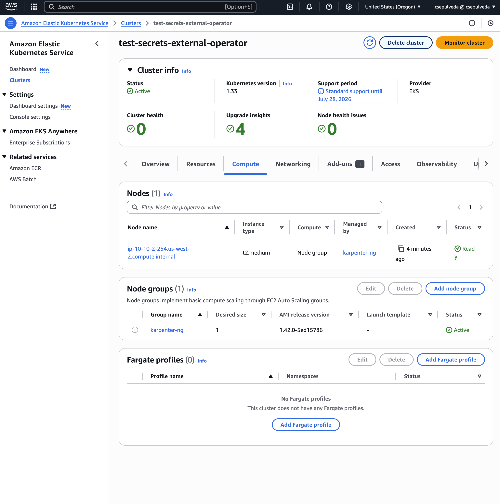

# KRO EKS Manager

Hey there! This repo lets you spin up AWS EKS clusters right from your local Kubernetes setup. Pretty cool, right? We're using a local k3s cluster running KRO and ACK operators to manage AWS resources. The best part? Created EKS clusters automatically show up in ArgoCD, so you can deploy apps without breaking a sweat!

## What You'll Need

- A local k3s cluster running on your machine
- ArgoCD already installed on that cluster
- AWS IAM access keys with the right permissions

## Getting Started

### 1. Set Up Namespaces & AWS Creds

```bash
# Create the namespace we'll need
kubectl create namespace ack-system

# Drop your AWS credentials in both namespaces
kubectl create secret generic aws-credentials -n ack-system \
  --from-file=credentials=~/.aws/credentials_testing_account
kubectl create secret generic aws-credentials -n argocd \
  --from-file=credentials=~/.aws/credentials_testing_account
```

### 2. Install the KRO Operator

```bash
helm install kro oci://ghcr.io/kro-run/kro/kro --namespace kro --create-namespace --version=0.3.0
```

### 3. Get the ACK Operators Running

```bash
# IAM controller
helm upgrade -i iam-ack-us-west-2 --create-namespace -n ack-system \
  oci://public.ecr.aws/aws-controllers-k8s/iam-chart \
  --set aws.region=us-west-2 \
  --set aws.credentials.secretName=aws-credentials \
  --set aws.credentials.profile=default

# EC2 controller
helm upgrade -i ec2-ack-us-west-2 --create-namespace -n ack-system \
  oci://public.ecr.aws/aws-controllers-k8s/ec2-chart \
  --set aws.region=us-west-2 \
  --set aws.credentials.secretName=aws-credentials \
  --set aws.credentials.profile=default

# EKS controller
helm upgrade -i eks-ack-us-west-2 --create-namespace -n ack-system \
  oci://public.ecr.aws/aws-controllers-k8s/eks-chart \
  --set aws.region=us-west-2 \
  --set aws.credentials.secretName=aws-credentials \
  --set aws.credentials.profile=default
```

### 4. Hook Up ArgoCD with AWS Credentials

Add this to your ArgoCD values config:

```yaml
server:
  volumes:
    - name: aws-creds
      secret:
        secretName: aws-credentials
  volumeMounts:
    - mountPath: /home/argocd/.aws
      name: aws-creds
      readOnly: true

repoServer:
  volumes:
    - name: aws-creds
      secret:
        secretName: aws-credentials
  volumeMounts:
    - mountPath: /home/argocd/.aws
      name: aws-creds
      readOnly: true

controller:
  volumes:
    - name: aws-creds
      secret:
        secretName: aws-credentials
  volumeMounts:
    - mountPath: /home/argocd/.aws
      name: aws-creds
      readOnly: true
```

### 5. Install the ResourceGraph

```bash
kubectl apply -f eks-cluster.yaml
```

## Creating Your EKS Cluster

Just define your cluster in a simple YAML file:

```yaml
apiVersion: kro.run/v1alpha1
kind: EKSCluster
metadata:
  name: test-secrets-external-operator
spec:
  name: test-secrets-external-operator
  vpcCIDR: "10.10.0.0/16"
  subnetACIDR: "10.10.0.0/18"
  subnetBCIDR: "10.10.64.0/18"
  version: "1.33"
  adminARN: "arn:aws:iam::279606005479:user/csepulveda"
```

Apply it and watch:

```bash
kubectl apply -f eks-cluster.yaml
```

```bash
kubectl get ResourceGraphDefinition/ekscluster.kro.run -o yaml | yq .status
```

## Test Drive with a Sample Deployment

The ResourceGraph automatically adds a test nginx app to ArgoCD and deploys it on your shiny new EKS cluster, complete with an ELB.

Try creating a test cluster for External Secrets Operator:

```bash
kubectl apply -f eso-eks.yaml
```

Check how it's going:

```bash
kubectl get EKSCluster
NAME                             STATE         SYNCED   AGE
test-secrets-external-operator   IN_PROGRESS   False    39s
```

Once everything's up and running, you'll see:
- The EKS cluster fully operational
- The test nginx app deployed in ArgoCD
- The new server added to your setup




## Heads Up! ⚠️

There's a known issue with KRO 0.3.0 and secrets. Since the ArgoServer is defined using `stringData`, KRO gets stuck in an infinite loop of drift status. This happens because `stringData` gets transformed to `data` and keeps triggering updates.

**Quick Fix**: After the instance is created, edit the `stringData` section from the ResourceGraphDefinition (lines 307-324).

## Final Thoughts 🤔

This setup is perfect if you're like me and don't want to run EKS 24/7. I built this for my bare-metal cluster where I only need EKS for specific testing. It creates all resources from scratch and tears them down completely when done, saving those precious AWS credits.